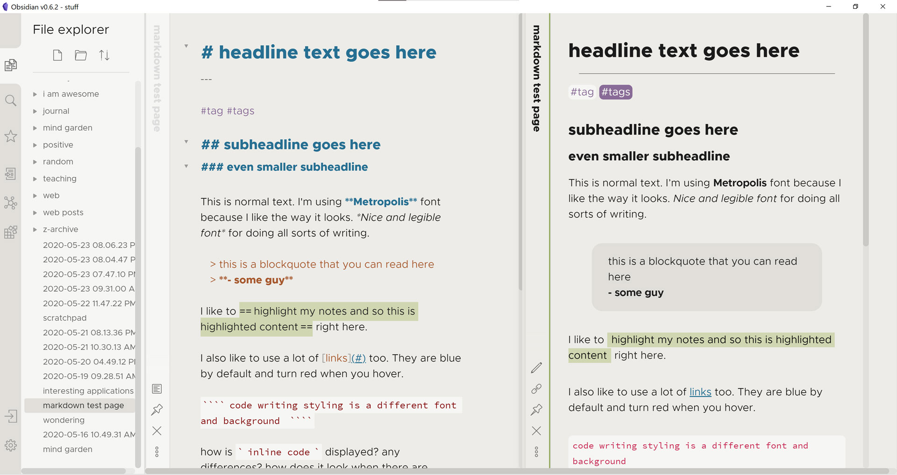
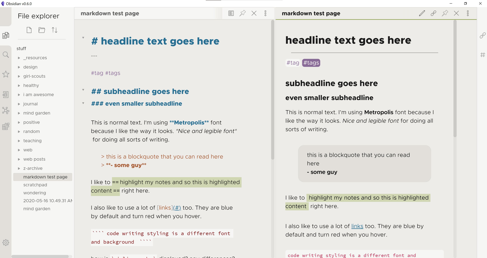

# Warmth Obsidian theme

a light theme for [Obsidian](https://obsidian.md/) app with warm earth tones. 

**no longer maintained - check out my new theme, now with colors from warmth**

this theme is part of the community themes. a lot of people are using it even though it needs a lot of updating and refining. i pulled some of the colors from the warmth theme into my more current theme [al-dente](https://github.com/chad-bennett/al-dente-obsidian-theme). it has become my main driver. i hope you like it too.

as always, please let me know if there are issues or tweaks you think would improve the theme. 

---

using [Metropolis](https://github.com/chrismsimpson/Metropolis) font, but can easily swap out for you favorite font. 

***a work in progress, so if you have ideas for tweaks or changes, please let me know.*** 

---

## to install theme

1. download `obsidian.css` and place in the default directory of your Obsidian vault.
2. enable themes option in Obsidian settings

## Version 2

now includes Andy Matuschak mode for vertical title bar 
also includes collapsing sidebars

---

# Screenshots

### Version 2

### Version 1

